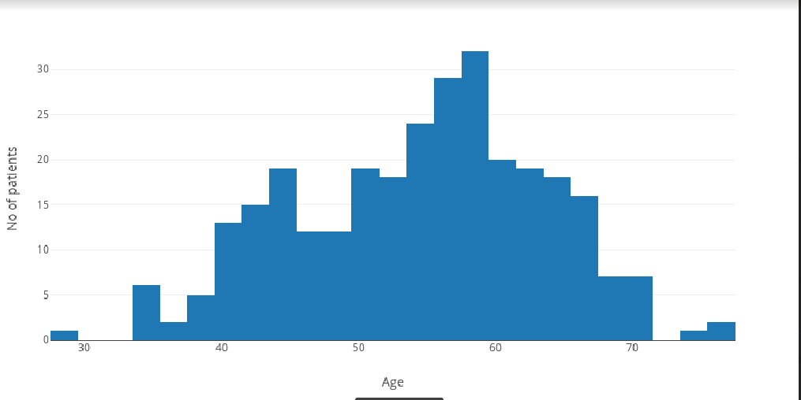
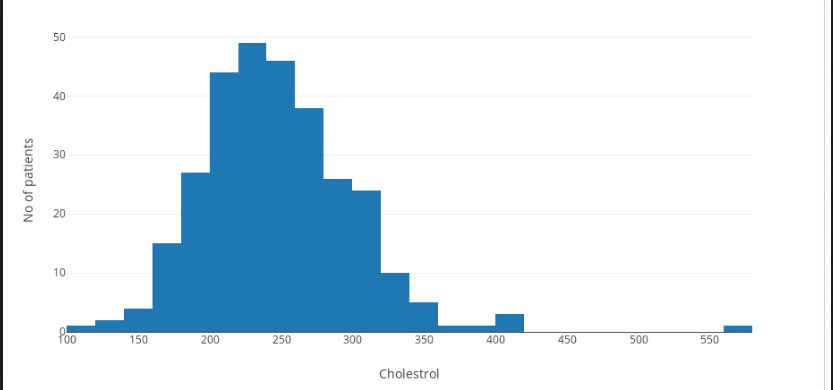
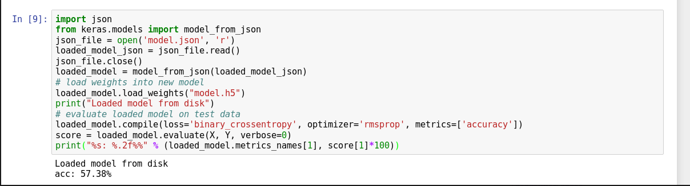
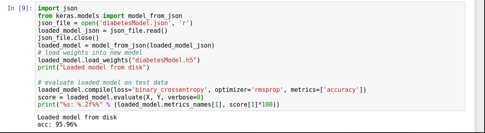
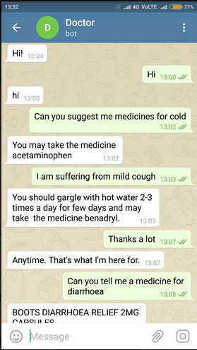
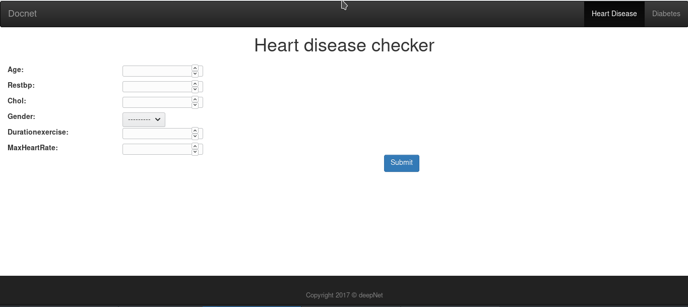

# Docnet
Heart attacks, strokes, diabetes and other cardiovascular (CV) diseases continue to be among the top 
public health issues. Assessing this risk is critical first step toward reducing the likelihood that a 
patient suffers a CV event in the future. To do this assessment, doctors take into account a 
variety of risk factors — some genetic (like age and sex), some with lifestyle components (like smoking and blood pressure). 
As most of these factors can be obtained by simply asking the patient, others factors, like cholesterol, require a blood draw. 
We use these factors and existing heart disease and diabetes dataset from UCI to make a chatbot to predict these diseases based on these factors.

## Screenshots
### Data Visualization

### Models evaluaion

### Chatbot

### Website

## Team Members
* [Divyam Madaan](https://github.com/divyam3897)
* [Radhika Dua](https://github.com/Radhikadua123/)
